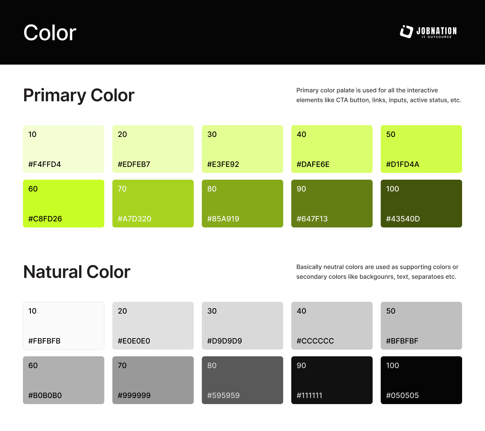
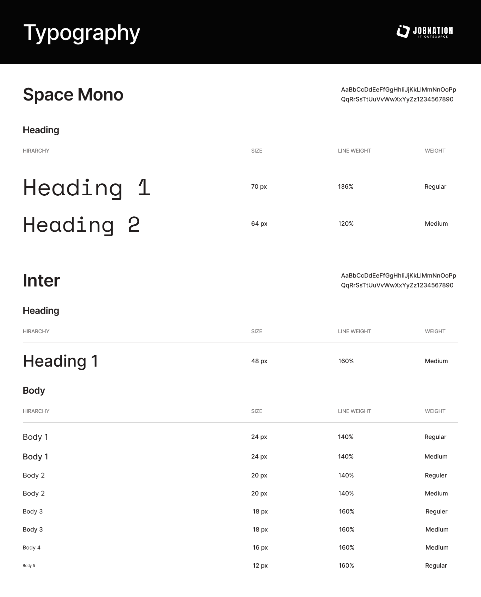
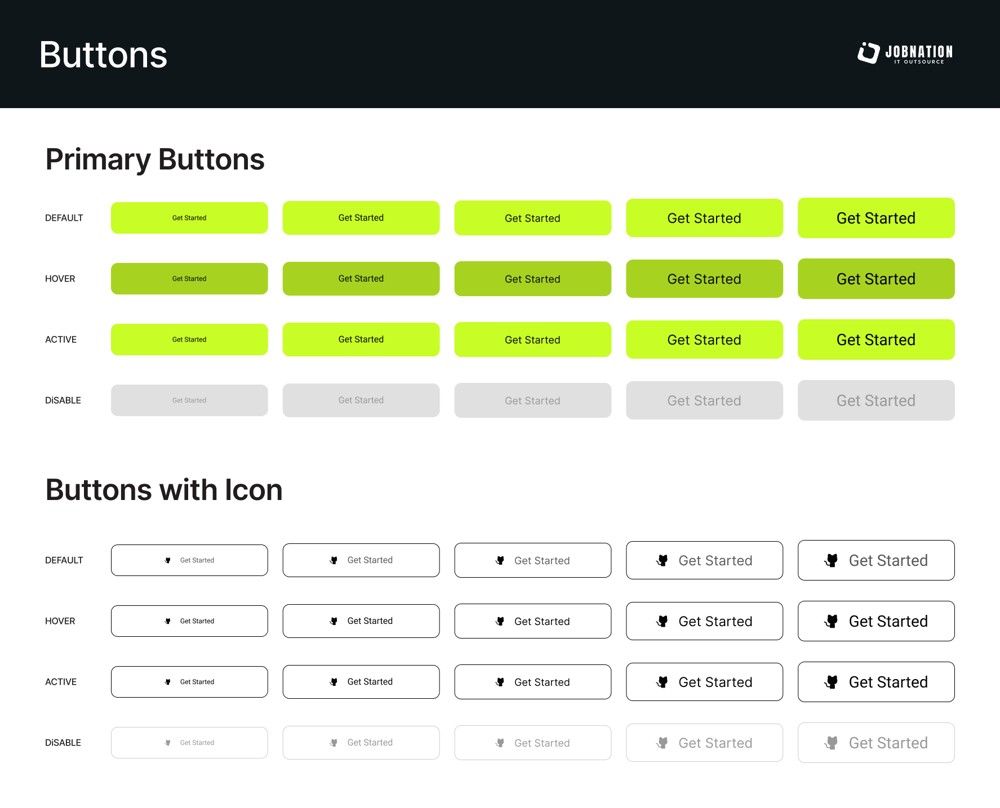
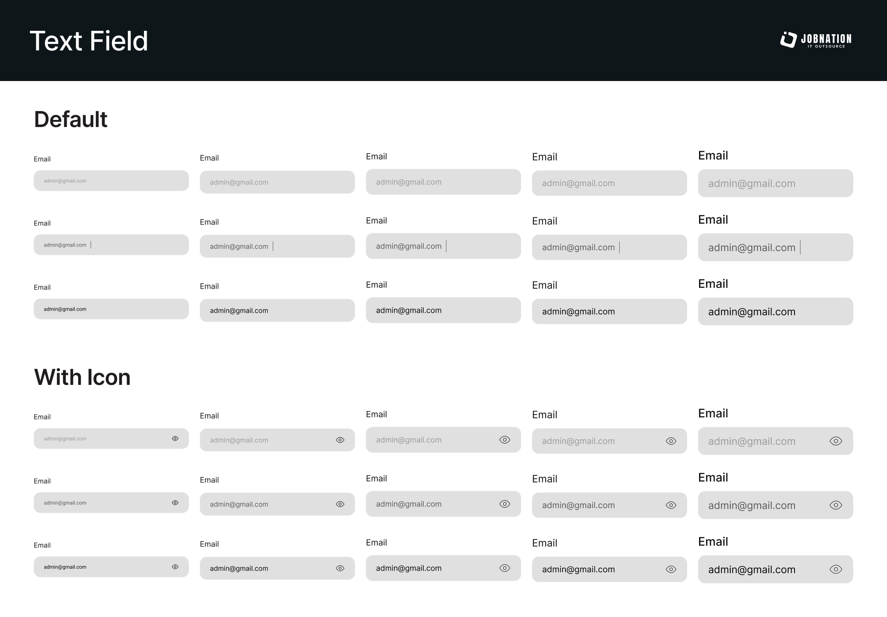
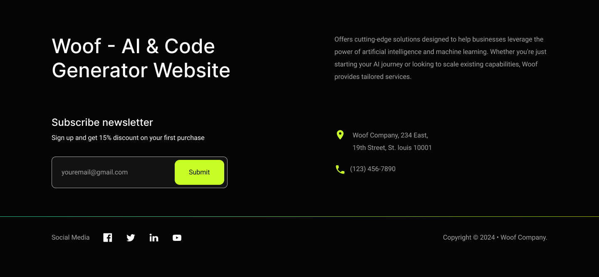

# Woof Project Design System

This guide is the project source of truth for UI styling. Future screens, components, and pages should follow these references unless the user provides a newer design.

## Reference Images











## Core Direction

- Use a clean, high-contrast interface with bright lime as the primary interactive color.
- Keep most surfaces neutral: white, near-white, gray, and black.
- Use the primary palette for CTA buttons, links, focused/active states, selected states, and important interactive accents.
- Use neutral colors for text, backgrounds, borders, dividers, disabled states, and input surfaces.
- Keep controls softly rounded and simple. Avoid decorative gradients, extra shadows, and unrelated color families.

## Color Tokens

### Primary Palette

| Token | Hex | Usage |
| --- | --- | --- |
| `primary-10` | `#F4FFD4` | Subtle primary backgrounds |
| `primary-20` | `#EDFEB7` | Light active backgrounds |
| `primary-30` | `#E3FE92` | Light highlights |
| `primary-40` | `#DAFE6E` | Hover accents |
| `primary-50` | `#D1FD4A` | Bright accent |
| `primary-60` | `#C8FD26` | Main CTA/default primary button |
| `primary-70` | `#A7D320` | Primary hover |
| `primary-80` | `#85A919` | Strong active/accent |
| `primary-90` | `#647F13` | Dark primary text/accent |
| `primary-100` | `#43540D` | Deep primary |

### Neutral Palette

| Token | Hex | Usage |
| --- | --- | --- |
| `neutral-10` | `#FBFBFB` | Page background / light surface |
| `neutral-20` | `#E0E0E0` | Soft input background |
| `neutral-30` | `#D9D9D9` | Input background / disabled fill |
| `neutral-40` | `#CCCCCC` | Borders / dividers |
| `neutral-50` | `#BFBFBF` | Muted borders |
| `neutral-60` | `#B0B0B0` | Placeholder text |
| `neutral-70` | `#999999` | Disabled text |
| `neutral-80` | `#595959` | Secondary text / icons |
| `neutral-90` | `#111111` | Main text |
| `neutral-100` | `#050505` | Highest contrast / header bars |

### CSS Token Starter

```css
:root {
  --color-primary-10: #f4ffd4;
  --color-primary-20: #edfeb7;
  --color-primary-30: #e3fe92;
  --color-primary-40: #dafe6e;
  --color-primary-50: #d1fd4a;
  --color-primary-60: #c8fd26;
  --color-primary-70: #a7d320;
  --color-primary-80: #85a919;
  --color-primary-90: #647f13;
  --color-primary-100: #43540d;

  --color-neutral-10: #fbfbfb;
  --color-neutral-20: #e0e0e0;
  --color-neutral-30: #d9d9d9;
  --color-neutral-40: #cccccc;
  --color-neutral-50: #bfbfbf;
  --color-neutral-60: #b0b0b0;
  --color-neutral-70: #999999;
  --color-neutral-80: #595959;
  --color-neutral-90: #111111;
  --color-neutral-100: #050505;

  --font-display: "Space Mono", monospace;
  --font-sans: "Inter", system-ui, -apple-system, BlinkMacSystemFont, "Segoe UI", sans-serif;

  --radius-control: 10px;
  --radius-small: 8px;
}
```

## Typography

Use `Space Mono` for large display headings and `Inter` for app headings, body copy, forms, and buttons.

| Style | Font | Size | Line Height | Weight |
| --- | --- | --- | --- | --- |
| Display Heading 1 | Space Mono | 70px | 136% | Regular |
| Display Heading 2 | Space Mono | 64px | 120% | Medium |
| Heading 1 | Inter | 48px | 160% | Medium |
| Body 1 | Inter | 24px | 140% | Regular |
| Body 1 Medium | Inter | 24px | 140% | Medium |
| Body 2 | Inter | 20px | 140% | Regular |
| Body 2 Medium | Inter | 20px | 140% | Medium |
| Body 3 | Inter | 18px | 160% | Regular |
| Body 3 Medium | Inter | 18px | 160% | Medium |
| Body 4 | Inter | 16px | 160% | Medium |
| Body 5 | Inter | 12px | 160% | Regular |

## Buttons

### Primary Buttons

- Default background: `primary-60` (`#C8FD26`)
- Hover background: `primary-70` (`#A7D320`)
- Active background: `primary-50` (`#D1FD4A`) or a nearby bright primary tone when pressed
- Disabled background: `neutral-30` (`#D9D9D9`)
- Disabled text: `neutral-70` (`#999999`)
- Text color: `neutral-100` or `neutral-90`
- Shape: rounded rectangle, usually `10px` radius
- Style: flat fill, no heavy shadow

### Buttons With Icon

- Default background: `neutral-10` or white
- Border: `neutral-90` / black for enabled states
- Hover/active: keep the same clean outline style and strengthen text/icon contrast
- Disabled border: `neutral-40`
- Disabled text/icon: `neutral-70`
- Icon should sit before the label with balanced spacing.

## Text Fields

### Default Fields

- Label: `Inter`, medium where needed, `neutral-90`
- Field background: `neutral-30` (`#D9D9D9`) or `neutral-20` for softer surfaces
- Placeholder: `neutral-60`
- Entered text: `neutral-90`
- Border: none by default
- Radius: about `10px`
- Focus: preserve the simple gray field style; use caret and text contrast before adding loud outlines

### Fields With Icon

- Follow default field styling.
- Place the icon at the right edge inside the field.
- Icon color: `neutral-80`
- Keep the icon subtle and functional, such as password visibility.

## Footer

- Use `neutral-100` as the full footer background.
- Use `neutral-10` for the main heading, newsletter heading, input text, and social icons.
- Use `neutral-60` and `neutral-70` for secondary copy, contact text, social labels, and copyright text.
- Use `primary-60` for the newsletter submit button, location/phone icons, and the bottom divider accent.
- Footer content should sit in a centered max-width container and remain split into left content and right description/contact columns on desktop.
- Newsletter form follows the project text-field shape with a dark transparent field, `neutral-60` border, and an inset primary CTA button.
- Footer appears at the bottom of every page and should be reused as a shared component, not recreated per page.

## Implementation Notes

- Prefer reusable component classes or design tokens over one-off colors.
- Do not introduce new primary colors unless the design reference is updated.
- Keep text readable and controls consistent across mobile and desktop.
- When creating a new page or component, start from these tokens before adding custom styling.
